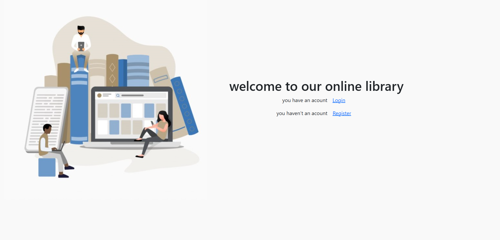
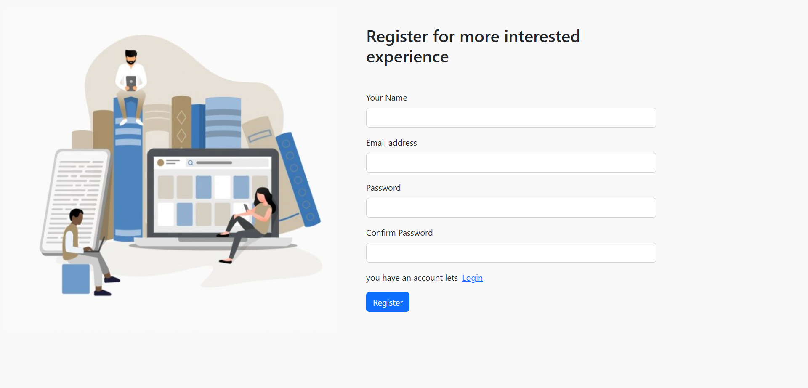
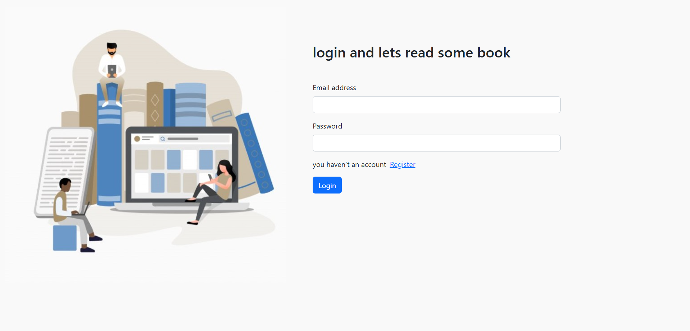

# onlineLibrary React App

## ✨ Project Overview
**onlineLibrary React** is a modern, responsive website built with **React**.  
This project demonstrates my ability to create dynamic and interactive web applications using modern front-end technologies, focusing on both functionality and visual appeal.

---

## 🔨 Key Features
- **Responsive Design:** Fully mobile-friendly and optimized for all devices.  
- **User Interaction:** Smooth animations and dynamic UI built with React components.  

---

## 👨‍💻 Technologies Used
- **React**  
- **JavaScript (ES6+)**  
- **CSS / Sass**  
- **React Router**  
- **Axios** for API calls  
- **Responsive Design / Flexbox / Grid**

---
🔗 **Live Demo:** https://drive.google.com/file/d/1PtHepSvfxsQs8FDxwsajxLU7XoLeUUur/view?usp=drive_link

## 📸 Screenshots
### 🏠 Home Page

### 📄 Register Page

### 📄 Login Page

 
